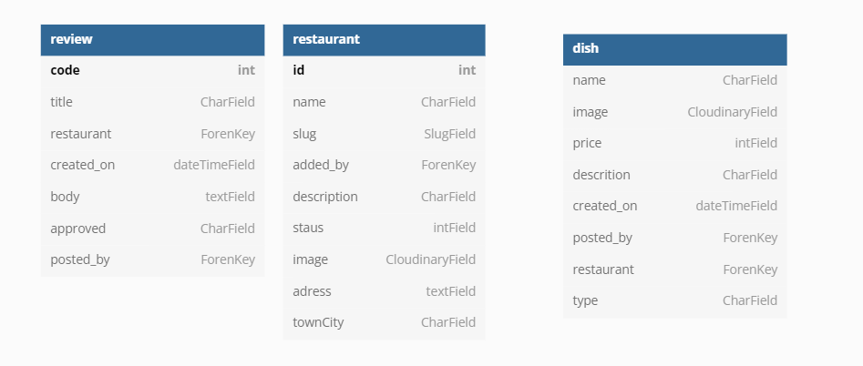

tech
- summernote 

images-
usplash
restaraunt-image-1 https://unsplash.com/photos/GXXYkSwndP4 
chipy - https://unsplash.com/photos/YOW3de4wEDk
go vegan - https://unsplash.com/photos/FoVrVBxEefU
favicon - https://pixabay.com/vectors/avocado-slice-heal-fresh-green-5130214/

acknolegemnts
dave and dasiy mentor - deployment
Daniel_C_5p - advise on testing

note remove development in config vars bfore submitting project.

tech
https://favicon.io/favicon-converter/
google fonts https://fonts.google.com

# Does it Vegan
Click [here](#) to view the live web site 

### responsive design 

## UX

## Strategy
 

## Goals
* Create a web site that help people fins restaurant that have vegan dishes in there area
* Have a web site that has a simple search function for users
* Users can post reviews of restaurant   
* users can add restraunts and dishes
* users can edit and delete dishes and reviews
* admin can delete users and aprove reviews

##### To achieve these goals I will need to:
* use python and django to creat a full stack web site
* Use CSS and HTML for the content and to make it look good
* create a functional data base
* deploy the site to heroku. 

#### agile
* used kanban board in github projects to work in an agile manner.  <a href='https://github.com/CraigThomasson/Does_It_-Vegan/projects/1'>view</a>

#### user stories 
* user stories can be vied on kanban board here.

## Wireframe for Original Concept

## data base schema

 

## Functionality
## Load Screen

* On the load screen the user will see the title and hero image and see clearly the intentions the page. There are instructed to search for a town or city. The  colour scheme is a nice vegan green. 
* The user will see the instructions for how to begin search for a location or can add there own restaurant.
 

## search results

* If the user search is successful they will see the results on this page
* A user can read a brief description of each restaurant returned 
* A user can click on the view button to view a restaurant
* As this image is being generated by JS and is purely decorative, an alt tag has not been added. Adding the functionality to populate the alt tag is possible in the JS function that generates the image, but this is out of scope for this project. 

## response box

* Once the user selects an answer they will see a correct or incorrect answer box.
* The correct answer box confirms the answer is correct and displays a button to move to the next question.
* The incorrect answer box tells the user the answer was wrong and also displays the correct answer. There is also a button to move on to the next question. 
* Once a question is answered the user will also see the question counter move up as well as the correct and incorrect answer counters. This helps the user keep track of their progress. 

## endquiz box

* When the user has answered 5 questions the quiz will end and a box will be displayed informing the user of this.
* The box contains a message with text inspired by a popular phrase in the book series, this should help the user stay immersed in the theme of the quiz. 
* The user's score is also displayed.
* There is a button to return the user to the load page. This button also contains text thematically in line with the book series. 

## Footer

* The Footer is styled to match the header and to close off the page in an aesthetically pleasing way.
* It contains links to my Github, Linkedin and also copyright info.

## Deployment

This project was deployed to Github pages.
* In your repository on Github click settings
* Click the pages tab
* On the drop-down menu under source, select your main branch
* Click save

### Clone to Run Locally
* In the repository on Github click the Code drop-down button next to the green Gitpod button
* Download ZIP file and unpackage locally and open with IDE. 

### Fork the Repo
* On GitHub, navigate to the repository you want to fork
* In the top right corner of the page, click Fork

## Testing

* The site was tested in [google chrome](documentation/images/load-page.PNG), [Firefox](documentation/images/firefox.PNG), [Microsoft edge](documentation/images/edge.PNG) and [safari](documentation/images/safari.PNG).
* It was also tested on [android](documentation/images/android.jpg) and [IOS](documentation/images/ios-2.jpg) phones.
* Text in buttons on IOS was showing as blue originally. To fix I specified button colour in CSS.
* As evidenced above I also tested on multiple view ports.
* Links in footer were all tested to ensure they link to the correct pages.
* The quiz was also play tested by members of a Wheel of Time fan group on Facebook. [playtest-1](documentation/images/playtest-1.PNG) [playtest-2](documentation/images/playtest-2.PNG) [playtest-3](documentation/images/playtest-3.PNG) [playtest-4](documentation/images/playtest-4.PNG)
* 1 bug in the code was found in the play test that caused an extra question to be displayed when the quiz ends. To fix this I simply hid the question box in the end game function.
* Several spelling/grammar issues were also found and fixed.
* The feedback for the usability and play ability of the quiz was overwhelmingly positive. The group enjoyed the language inspired by the book and found the quiz somewhat challenging on the harder level.

## Validation

* CSS was ran through (Jigsaw) validator and has no errors: results [here](documentation/images/css-val.PNG)
* HTML was ran through W3C validator with no issues: results <a href="http://validator.w3.org/check?uri=https://craigthomasson.github.io/project-2-wheel-of-time-quiz/">here</a>
* JS was ran through JSHint with [these](documentation/images/js-val.PNG) results. (There were also several missing semicolons that I added befre taking this screenshot.)

## Lighthouse Scores

* These are results from my second run. In my first run I had to add margins to difficulty buttons for mobile sizes and meta description in the head of the HTML.
* I also changed a h3 element to h2 to help with accessibility. 

## Technologies used
HTML, CSS and JavaScript.
https://www.favicon.cc/ for favicon.

## credits 

### Sources and References
* Google fonts were used in this project: https://fonts.google.com/
* Font Awesome was used in the footer: www.fontawesome.com
* Images:
    https://www.pexels.com/photo/man-holding-sword-3408420/
    https://pixabay.com/photos/corridor-architecture-ruins-6572354/
    https://pixabay.com/photos/smoke-backdrop-macro-creative-4988505/
    https://pixabay.com/photos/notes-book-game-play-books-art-2656005/ 
    https://pixabay.com/photos/blacksmith-pincers-tools-smithy-2703384/
    https://pixabay.com/photos/forest-mist-nature-trees-mystic-931706/
    https://www.yahoo.com/lifestyle/wheel-time-aes-sedai-explained-154407640.html
    https://dragonmount.com/gallery/image/1702-ogier/
    https://www.tor.com/2020/04/23/why-cant-anyone-see-mat-cauthon-changing/
    https://pixabay.com/photos/zanzibar-stone-town-tanzania-africa-4271064/
    https://pixabay.com/photos/wolves-wolf-howling-moon-stars-1400819/
    https://www.instagram.com/p/BjGiL5MHLeL/
    https://pixabay.com/illustrations/crystal-ball-glass-sphere-bullet-4043805/
    https://www.pexels.com/photo/person-holding-brown-wooden-tray-with-cookies-6014303/
    https://www.pexels.com/photo/selective-focus-photography-of-child-s-hand-1250452/
    https://unsplash.com/photos/wfVREQs7KXQ
    https://pixabay.com/photos/bar-pub-comfortable-the-atmosphere-3407484/
    https://pixabay.com/photos/horse-soldier-warrior-war-battle-4596827/
    https://otakukart.com/561823/amazons-epic-the-wheel-of-time-is-finally-set-for-a-2021-release/

## acknowledgements

* I would like to thank my mentor Chriss Quinn again for pushing me to produce my best work and being the best mentor that ever mentored.
* Thank you to everyone in the Wheel of Time <a href="https://www.facebook.com/groups/2251256361856379">fan group</a> for all of their great feedback.
* Thanks to Matt Bodden 5p for helping me fix an issue with file paths for my images.
* Thanks to David Bowers_5p and Eventyret_mentor for helping with favicons.

### source
* Code institute love sandwich project code was used as base for my event listeners (line 3 - line 15 in script.js).

* Sean young_lead from CI slack community pointed me to the fisher-yates shuffle to help me with issues with my random question generator.  

* Used code from love maths project to increment scores.